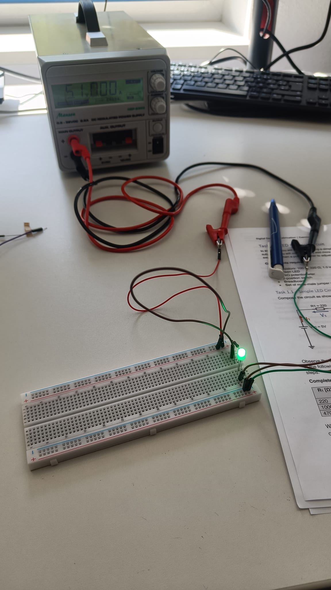
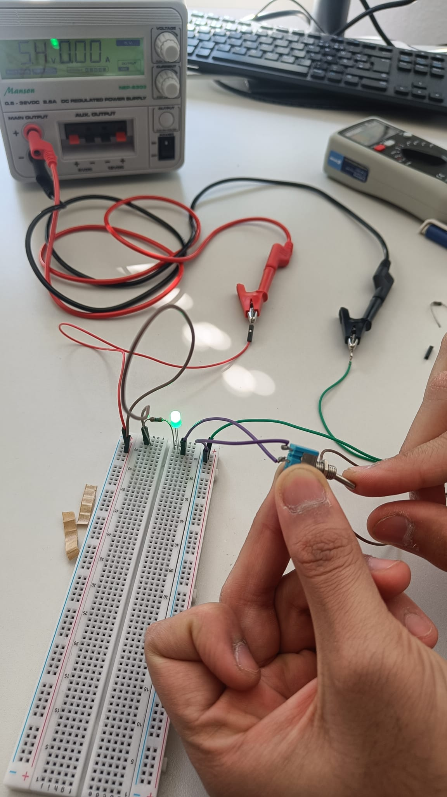
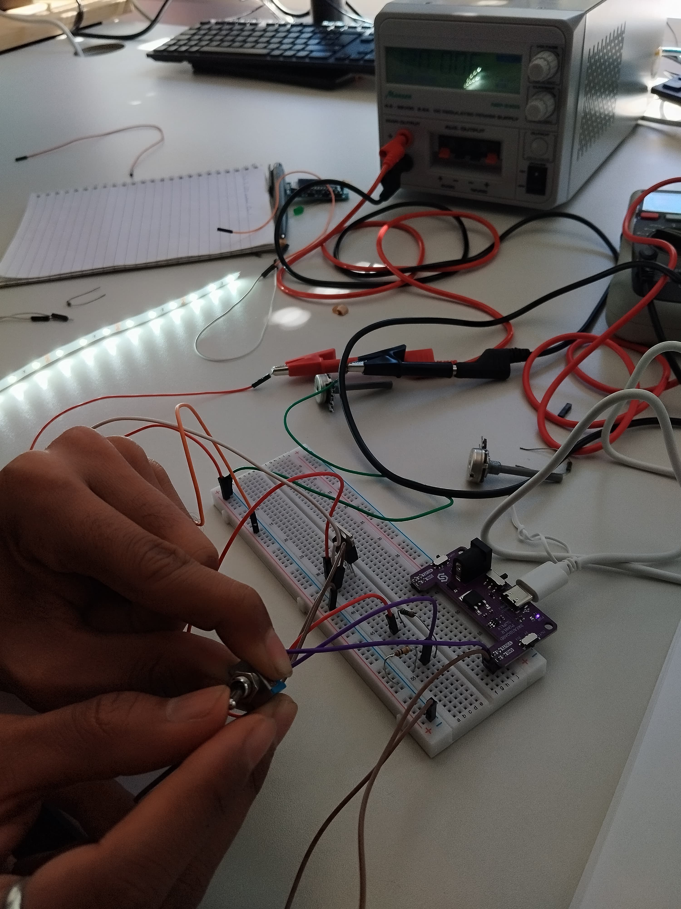
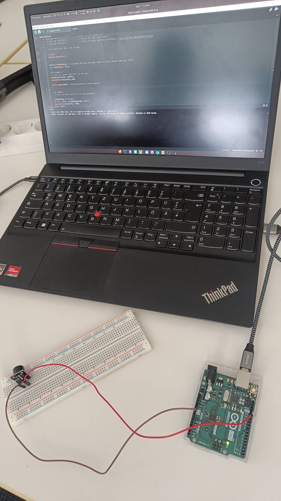
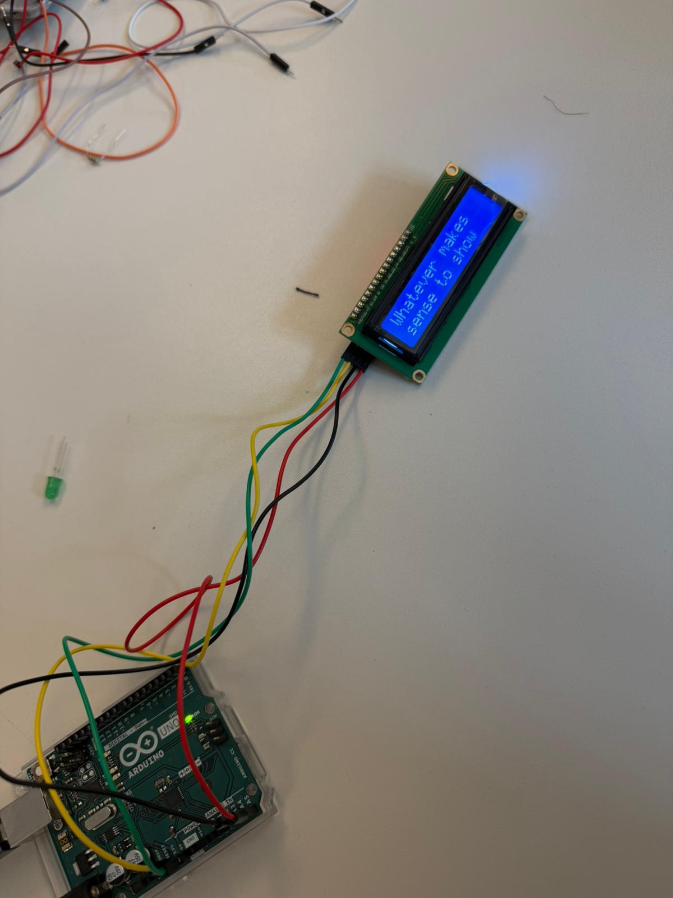
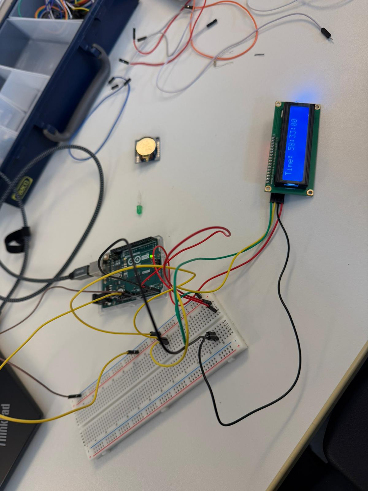

# 🌐 My Design Logbook – Digital Design & Fabrication Portfolio

## 👤 About Me
- **Name:** Dhruvit Koyani  
- **Email:** dhruvit.koyani@uni-oldenburg.de
- **University:** Carl von Ossietzky University of Oldenburg
- **Program:** M.Sc. Engineering of Socio-Technical Systems  
- **Matrikelnummer:** 6649717

---

## 📘 Course Information
- **Course:** Digital Design & Fabrication (inf175) 
- **Semester:** Summer Semester 2026    

---

## 📂 Portfolio Overview
This repository documents my learning journey in the **Digital Design & Fabrication** course.

It follows a blog-style structure where each exercise represents a step in the process of transforming digital ideas into physical outcomes.

Each exercise includes:
- Concept exploration  
- Design and workflow steps  
- Fabrication process  
- Reflections and learnings  

This portfolio focuses not only on final results but also on the thinking and iteration behind them.

---

# 🛠 Exercises

# 🧪 Exercise 1:  Electrical Circuits

## Introduction

In this lab, I built and tested five different electrical circuits to explore LED control and transistor switching. This portfolio documents the measurements, observations, and visual results of these experiments.

---

## Task 1: LED Control Circuit

### 1.1 Simple LED Circuit 
I tested the behavior of a green LED by swapping different resistors ($R1$) to observe changes in current and brightness.

| R1 [Ω] | Measured $V_1$ [V] | Measured $V_{LED}$ [V] |
| :--- | :--- | :--- |
| 220 | 2.28 | 2.86 |
| 1000 | 2.77 | 2.51 |
| 4700 | 2.97 | 2.31 |

### 💡 Observations

As the resistance of $R1$ increased, the brightness of the LED noticeably decreased. The voltage drop across $R1$ increased with higher resistance values. Changing $R1$ directly affected the LED operating voltage and brightness.

### 📷 Simple LED Circuit Setup

  

### 1.2 Switchable LED Circuit  

I introduced a 2-position switch and a 1kΩ potentiometer to control the state and intensity of the light.

### 💡 Observations

The switch acts as a physical break in the circuit. When the switch is in the "closed" position, the circuit is complete and the LED lights up. When it is "open," the current flow stops and the LED turns off.

When i connect the switch in opposite direction the LED still works exactly the same way because a switch doesn't have a positive or negative side. It doesn't matter which way you plug it in; its only job is to connect or disconnect the two points in the circuit.

### 📷 Switchable LED Circuit

  

### 1.3 Dimmable LED Circuit 

**Potentiometer Measurements:**
| Position | $V_{LED}$ [V] | $V_2$ [V] |
| :--- | :--- | :--- |
| **Full Brightness** | 3.01 V | 3.05 V |
| **Dimmed** | 2.30 V | 4.45 V |
| **OFF** | 0.005 V | 4.50 V |

### 💡 Observations

I observed that rotating the potentiometer provides smooth, continuous control over the LED's light intensity. My data shows an inverse relationship between the LED voltage ($V_{LED}$) and the potentiometer output voltage ($V_2$). This is an analog relationship where the potentiometer acts as a variable voltage divider.

### 🎥 Dimmable LED Demonstration (Analog)

[Watch Video](Task_1.3.mp4)

## Task 2: Transistor Switch Circuit

### 2.1 Switchable LED Strip 

Using an **IRLZ44N NPN MOSFET**, I controlled a 12V LED strip using a 5V control signal.

### 💡 Observations

I observed a specific behavior regarding the USB power board. When powering the 5V control side via a laptop or mobile device, the voltage was detected and the board functioned as expected. However, when using a direct power adapter, the USB module did not show the same behavior or detection.

**Principle of Operation:**
The MOSFET acts as an electronic switch. When 5V is applied to the **Gate**, it allows current to flow from the **Drain** to the **Source**, completing the 12V circuit for the LED strip.

### 📷 MOSFET Switching Setup

  

---

### 2.2 Dimmable LED Strip
I used a PWM generator at 90Hz to observe how the **Duty Cycle** and **Frequency** affect the perceived light.

#### Part A: Duty Cycle ($f = 90\text{Hz}$)

### 💡 Observations

* **2% Duty Cycle:** The light was dim.
* **15% Duty Cycle:** The light was noticeably brighter than at 2%.
* **40% Duty Cycle:** The light reached a moderate level of brightness.
* **75% Duty Cycle:** The light was bright.
* **100% Duty Cycle:** The light was at its maximum brightness.

**Relationship:** I observed a direct linear relationship: as the **Duty Cycle increased**, the **brightness increased** proportionally. 
**Mechanism:** Even though the LED is technically switching ON and OFF rapidly, the eye perceives the average power as a change in intensity.

### 📷 PWM Duty Cycle Setup

  

#### Part B: Frequency ($D = 0.5$)
| Frequency [Hz] | Visual Observation |
| :--- | :--- |
| **5 Hz** | Clear and distinct LED flicker/strobing effect. |
| **25 - 45 Hz** | Flicker is still visible but becoming much faster. |
| **60 - 65 Hz** | **Critical Point:** The light almost stops flickering; the pulses become nearly indistinguishable. |
| **100 Hz** | The flicker stops completely; the LED appears as a solid, steady glow. |

**Task 2.2 B: Frequency Observations (Persistence of Vision)**
*   **5 Hz Flicker:** f = 05 Hz.
    [Watch 5Hz Frequency Demo](Task_2.2_B_45_Hz.mp4)

*   **45 Hz Flicker:** f = 45 Hz.  
	[Watch 45Hz Frequency Demo](Task_2.2_B_5_Hz.mp4)

---

## Conclusion
Through this exercise, I learned the difference between analog dimming (potentiometer) and digital dimming (PWM), as well as the utility of MOSFETs in controlling high-voltage loads with low-voltage signals.

---
---

# ⏰ Exercise 2 – Arduino Alarm Clock

## 📖 Project Overview
In this exercise, I built a functional Arduino-based alarm clock using multiple electronic components and sub-circuits.

## 🔌 Sub-Circuit 1 – Buzzer Test

The first task was testing the buzzer using Arduino digital output.

### 📷 Circuit Images

  

### 💡 Observations
- Linux Problem with rights (sudo chmod 666 /dev/ttyACM0)
- Made loud beeping
- Didnt connect vin
- Library commented out
- had to switch to pin 12 into the source code
- No Resistor used -> causes louder peeping

---

## 📺 Sub-Circuit 2 – LCD Display

The LCD display was connected using I2C communication.

### 📷 LCD Circuit

  

### 🎥 LCD Demo

[Watch Video](Ex.2_Task.2.mp4)

### 💡 Observations & Challenges

- The information was displayed through the Serial Monitor instead of directly appearing on the LCD at first.
- Installed the additional Adafruit BusIO dependency library to make the LCD communication work correctly.
- Tested different outputs and displayed useful information on the screen once the setup was functioning.

---

## 🕒 Sub-Circuit 3 – RTC Module

The RTC module was added to keep real-world time.

### 📷 RTC Setup

  

### 🎥 RTC Working Video

[Watch Video](Ex.2_Task.3.mp4)

### 💡 Observations & Challenges
- Used Breadboard to connect the battery, with the LCD Display
- This confirmed that the button input was being detected correctly by the Arduino.
- Used real time
- After uploading file again, the current time was saved and reapplied again
	- We commented //rtc.adjust(DateTime(F(_DATE), F(TIME_))); out to achieve this

---

## 🔘 Sub-Circuit 4 – Push Buttons

Push buttons were connected using INPUT_PULLUP configuration.

### 🎥 Button Demo

(https://github.com/user-attachments/assets/dbd2c558-a7f7-4537-bc88-e2f6c9500fd0)

### 💡 Observations & Challenges
- When the push button was pressed, the onboard Arduino “L” LED lit up successfully.
- Buttons were used for alarm controls.

---

## ⏰ Final Alarm Clock

The final system combined all sub-circuits into one fully interactive alarm clock system developed through multiple iterations and custom modifications.

Unlike the basic example provided in class, this implementation included several additional interactive features and custom logic improvements.

### 🚀 Custom Features Implemented

- Multi-page LCD menu system
- Alarm enable/disable controls
- Custom alarm time configuration
- Multiple selectable alarm melodies
- Melody preview system
- Snooze functionality
- LED flashing visual feedback
- LCD backlight flashing during alarm
- Gesture-controlled snooze using ultrasonic distance sensor
- Real-time clock synchronization
- Interactive button navigation system

---

### 🎵 Melody System

Three different alarm styles were implemented:

| Melody Mode | Description |
|---|---|
| Classic Beep | Standard repeating alarm tone |
| Digital Pulse | Pulsing digital-style sound |
| Arpeggio Fun | Musical ascending tone pattern |

Users could preview melodies before selecting them.

---

### 👋 Gesture Control Feature

An ultrasonic distance sensor (URM37) was integrated into the system to create a gesture-based snooze function.

When the alarm rings:
- Waving a hand near the sensor automatically activates snooze mode.
- The system detects nearby motion using distance measurements.
- This created a touchless interaction system for the alarm clock.

This feature required additional testing and debugging because the sensor initially did not respond correctly.

---

### 🧪 Sensor Testing & Debugging

Before integrating the ultrasonic sensor into the final alarm system, a separate testing script was used to validate sensor communication and distance measurements.

The testing process helped verify:
- Trigger and Echo pin configuration
- Distance calculation
- Sensor timing behavior
- Hand wave detection range

After successful testing, the gesture detection logic was integrated into the final alarm clock system.

---

### 🔌 Final Alarm Clock Wiring

| Wire Color | Arduino Pin |
|---|---|
| White | Pin 3 |
| Red | Pin 2 |
| Yellow | Pin 4 |
| Black | Pin 5 |

---

### 🎮 Button Functions

| Button Color | Function |
|---|---|
| Red | Menu Navigation |
| White | Alarm ON/OFF |
| Yellow | Set Hour / Stop Alarm |
| Black | Set Minute / Snooze |

---

### 🎥 Final Working Demonstration

[▶ Watch Final Alarm Clock Demo](https://github.com/KoyaniDhruvit/dhruvit-ddf-portfolio/raw/main/Ex.2_Alaram.mp4)

---

